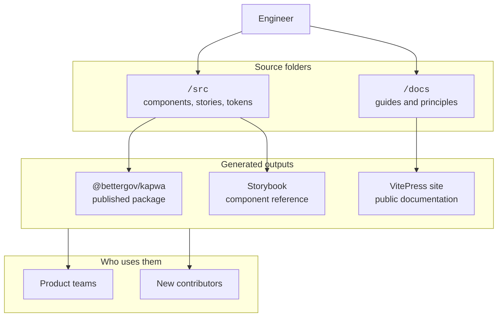

# Architecture

Kapwa is organized around two outputs:

- `src` produces the component library and Storybook component reference.
- `docs` produces this VitePress site.

Use that split when deciding where work belongs. Component implementation, component stories, and component-only helpers belong under `src`. Guidance, project context, contribution docs, and design decision records belong under `docs`.



## Repository Map

These are the parts of the repository most contributors need first:

- `src/lib/kapwa` contains exportable component library code.
- `src/lib/kapwa/**.stories.tsx` contains Storybook stories for those components.
- `src/styles/kapwa.css` contains the design token source of truth.
- `src/styles/kapwa.css` is the published style entrypoint for consumers.
- `docs` contains the VitePress documentation source.
- `docs/.vitepress/config.ts` configures the documentation site.
- `scripts/generate-component-exports.mjs` regenerates public package exports after a library build.
- `vite.config-lib.ts` defines the library build entry points.

Some older demo files still exist under `src` while the migration settles. Treat them as temporary. New public site content should go in `docs`, and new design system implementation should go in `src/lib/kapwa`.

## Source Responsibilities

### `src`

`src` is for the design system package and Storybook.

The stable component path is `src/lib/kapwa/<component-name>/`. Each component folder should contain an `index.ts` or `index.tsx` file that exports the public API for that component. Storybook stories should sit beside the component so contributors can inspect states, variants, and usage examples close to the implementation.

Shared package code should also stay under `src/lib/kapwa`. If shared code needs to be public, expose it through an `index.ts` file that follows the export rules below.

### `docs`

`docs` is for the VitePress site.

The docs site explains how Kapwa works, what principles shape it, and how engineers should contribute. The docs build does not define the component package API. If a page explains a component, it should point engineers to Storybook for the canonical interactive reference.

## Package Build

The package build is controlled by `vite.config-lib.ts`.

During `npm run build-lib`, Vite scans `src/lib/kapwa/**/index.ts?(x)` and creates library entry points for valid public modules. The build outputs JavaScript, CommonJS files, declaration files, sourcemaps, and copied CSS into `dist`.

The CSS entrypoints are copied directly:

- `src/styles/index.css` becomes `dist/index.css`.
- `src/styles/kapwa.css` becomes `dist/kapwa.css` and is imported by consumers as `@bettergov/kapwa/kapwa.css`.

React, React DOM, Tailwind-related packages, PostCSS, `lucide-react`, and similar consumer-owned dependencies are marked external so they are not bundled into the package.

## Export Rules

Public imports are convention-based. A file is exportable only when it matches the entry point rules used by both `vite.config-lib.ts` and `scripts/generate-component-exports.mjs`.

A top-level component entry point must look like this:

```txt
src/lib/kapwa/button/index.tsx
```

That creates a package subpath like this:

```ts
import { Button } from '@bettergov/kapwa/button';
```

It also contributes to the root package export generated in `src/index.ts`:

```ts
import { Button } from '@bettergov/kapwa';
```

Nested public entry points are allowed only for these folder names:

- `hooks`
- `types`
- `utils`

For example:

```txt
src/lib/kapwa/button/hooks/index.ts
```

That creates:

```ts
import { useButtonThing } from '@bettergov/kapwa/button/hooks';
```

Other nested folders can exist for private implementation, but they are not public package entry points unless the export generation rules are changed intentionally.

## Adding A Component

To add a new exportable component:

1. Create a folder under `src/lib/kapwa` using a stable kebab-case package name.
2. Add `index.tsx` or `index.ts` in that folder.
3. Export the component and any public component types from that `index` file.
4. Add a colocated Storybook file, such as `NewComponent.stories.tsx`.
5. Use Kapwa tokens from `src/styles/kapwa.css` instead of hard-coded theme values.
6. Run `npm run build-lib` so `dist`, `package.json` exports, `typesVersions`, and `src/index.ts` are regenerated.
7. Run Storybook or a Storybook build to verify the component reference.

The folder name becomes the import path. For `src/lib/kapwa/status-badge/index.tsx`, consumers should be able to import from:

```ts
import { StatusBadge } from '@bettergov/kapwa/status-badge';
```

Because `src/index.ts` is generated, do not hand-edit it to add the component. If the component has a valid `index.ts` or `index.tsx`, the generator adds the root export during `npm run build-lib`.

## Build Outputs

Kapwa produces these main outputs:

- `npm run build-lib` builds the component package into `dist` and regenerates package exports.
- `npm run build-site` builds the VitePress docs into `site`.
- `npm run build:storybook` builds Storybook into `site/storybook`.
- `npm run build` runs the release-oriented sequence for the package, docs site, and Storybook.

During local development:

- `npm run dev:site` runs the VitePress docs.
- `npm run dev:storybook` runs Storybook.
- `npm run dev` runs both together.

## Styling Model

The current styling model is:

- `kapwa.css` is the token source of truth.
- `index.css` is the Tailwind-facing integration layer.
- Consumers import Kapwa styles through the published package.
- Components should use semantic tokens so themes can change without rewriting component internals.

For the reasoning behind that choice, read [Token Architecture](/principles/token-architecture).
